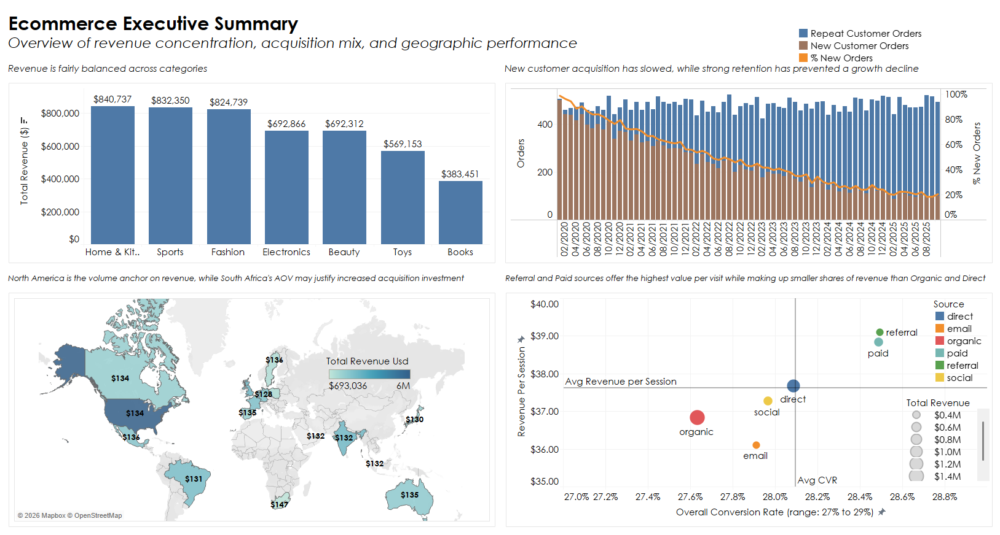
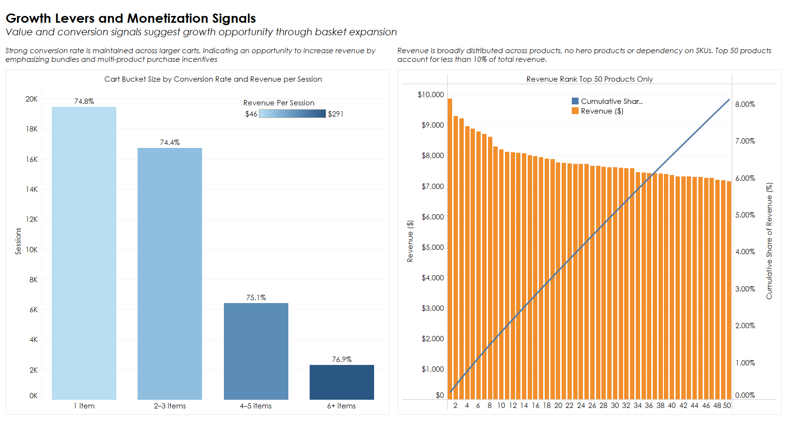
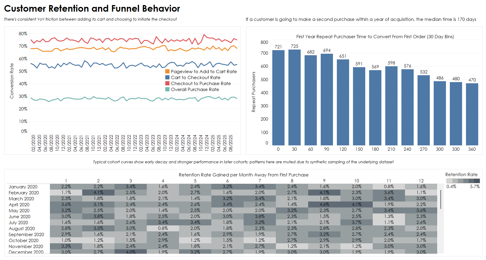

# Ecommerce SQL + Tableau Portfolio

This project explores an ecommerce dataset using MySQL for analysis and Tableau Public for visualization.  
The goal was to practice structuring real-world analytical questions, writing SQL to answer them, and then turning those results into clear visuals.

I focused on areas that come up frequently in marketing and growth analytics: revenue mix, new vs repeat customers, funnel drop-off, cart behavior, and where value concentrates across products and countries.

---

## Tableau Public dashboards

Interactive dashboards are available here:  
https://public.tableau.com/app/profile/quinn.willrich/viz/EcommerceSQLandTableauPortfolio/EcommerceExecutiveSummary

The workbook contains three dashboards, connected using in-dashboard navigation buttons.

---

## Dashboard 1: Ecommerce Executive Summary

This dashboard is meant to give a high-level view of how the business is performing.

Questions explored:
- How revenue breaks down by product category
- How order volume is split between new and repeat customers
- Which countries drive the most revenue and value per order

What stood out:
- Revenue is fairly spread across major categories rather than dominated by one.
- Repeat customers make up a growing share of total orders over time.
- North America and Western Europe drive most revenue, while some international markets show higher average order values.

---

## Dashboard 2: Growth Levers (Channels and Funnel)

This dashboard looks at acquisition sources and funnel behavior.

Questions explored:
- Where users drop off in the funnel
- How conversion rates differ by source and device
- Which channels generate more value per session

What stood out:
- The biggest and most consistent drop-off happens between add-to-cart and checkout.
- Conversion rates are fairly similar across channels, suggesting that scale and efficiency matter more than structural differences in the funnel.
- Paid and referral traffic generate higher revenue per session, even though they contribute less overall volume than organic and direct.

---

## Dashboard 3: Retention and Merchandising

This dashboard focuses on repeat behavior, cart size, and product concentration.

Questions explored:
- How long it takes customers to make a second purchase
- How cart size relates to conversion and revenue
- Whether revenue is concentrated among a small number of products

What stood out:
- Customers who repeat tend to do so within the first year, often within the first few months.
- Larger carts convert slightly better, but most sessions still involve small baskets.
- Revenue is spread across many products rather than being dominated by a small top tier.

---

## SQL analysis

All SQL queries are stored in the `/sql` directory and numbered in the order they were written:

- `01_revenue_by_category.sql`
- `02_top_products_by_revenue.sql`
- `03_repeat_purchase_gaps.sql`
- `04_new_vs_repeat_orders.sql`
- `05_cohort_retention.sql`
- `06_session_funnel.sql`
- `07_funnel_by_device.sql`
- `08_funnel_step_dropoff_and_revenue_by_source.sql`
- `09_country_value_vs_volume.sql`
- `10_cart_size_value_and_conversion.sql`
- `11_product_and_revenue_concentration_pareto.sql`

Each query output was exported to CSV and used directly in Tableau.

---

## Notes on the dataset

This dataset appears to be synthetic or sampled, which affects how some results should be interpreted.

### Revenue discrepancies
- Order-level revenue does not perfectly reconcile with item-level revenue.
- In real ecommerce data this can happen due to shipping, tax, discounts, or refunds, but the differences here are not consistently explained.
- For that reason:
  - Product and category analysis uses item-level revenue
  - Funnel and customer analysis uses order-level data

### Cohort behavior
- In real ecommerce data, cohort retention usually drops sharply after the first purchase and then tapers.
- In this dataset, cohort curves are flatter and less differentiated, which suggests sampling effects rather than true lifecycle behavior.
- The cohort view is included for completeness, but conclusions are drawn cautiously.

---

## Tools used
- MySQL
- Tableau Public
- GitHub

---
